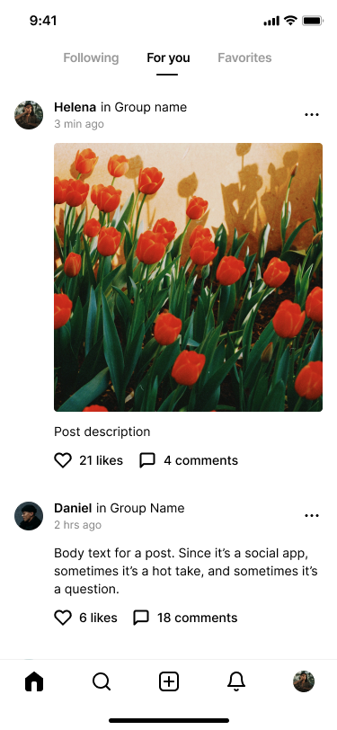

# 📱 Layar Teman & Kabar (Social Feed)

Halo lagi, teman kecil! 👋 Sekarang kita masuk ke layar yang seru: tempat melihat **kabar dan foto dari teman-teman**. Mirip papan pengumuman di sekolah, tapi penuh foto keren! 📸

> 💡 **Ingat ya:** Di layar ini kamu bisa lihat cerita orang lain, kasih tanda suka ❤️, dan menulis komentar. Yuk kita lihat bagian-bagiannya!

## 👀 Yuk Lihat Tampilannya Dulu!

<figure><figcaption>
📱 Layar Teman & Kabar — penuh cerita seru!
</figcaption></figure>

## 🔝 1. Tiga Pilihan di Atas (Tabs)

Di paling atas ada 3 kata: **Following**, **For you**, dan **Favorites**.

- 👥 **Following** = kabar dari teman yang kamu ikuti.
- ✨ **For you** = pilihan spesial untukmu (sekarang sedang aktif).
- ⭐ **Favorites** = yang paling kamu sukai.

Seperti memilih saluran TV — tinggal pencet, gambarnya ganti! 📺

## 🖼️ 2. Kotak Cerita (Post)

Tiap kotak adalah satu **cerita** dari seseorang. Isinya:

1. 👤 **Nama** orang dan grupnya (contoh: *Helena in Group name*)
2. ⏰ **Waktu** diunggah (contoh: *3 menit lalu*)
3. 📷 **Foto** yang dibagikan (lihat, ada bunga tulip merah! 🌷)
4. 📝 **Tulisan** singkat tentang fotonya

## ❤️ 3. Tombol Suka & Komentar

Di bawah tiap cerita ada:

| Gambar | Nama | Gunanya |
|--------|------|---------|
| ❤️ | **Likes** | Tekan kalau kamu suka. Contoh: *21 likes* |
| 💬 | **Comments** | Tempat menulis pesan. Contoh: *4 comments* |

Seperti kasih jempol 👍 dan ngobrol sama teman tentang fotonya!

## 🧭 4. Tombol Bawah (Tab Bar)

| Gambar | Gunanya |
|--------|---------|
| 🏠 | Kembali ke halaman depan |
| 🔍 | Mencari teman atau cerita |
| ➕ | **Membuat cerita baru** milikmu! |
| 🔔 | Lonceng pemberitahuan |
| 👤 | Halaman tentang kamu |

## 🎓 Yuk Uji Ingatanmu!

1. Tombol ➕ di bawah untuk apa? 🤔
2. Kalau suka sebuah foto, kamu tekan gambar apa? ❤️
3. Tiga kata di atas (Following, For you, Favorites) namanya apa?

> ✅ **Jawaban:** 1) Membuat cerita baru. 2) Tombol hati/Likes. 3) Tabs (pilihan).

## 🌟 Selamat!
Kamu sekarang paham layar **Teman & Kabar**! Lanjut ke petualangan berikutnya ya! 👋
