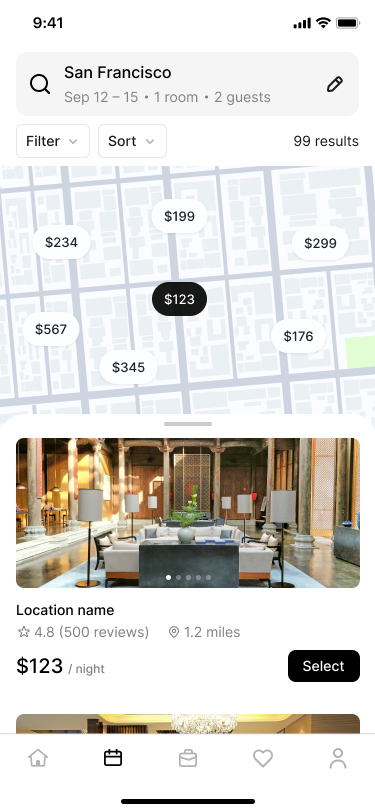

# 🏨 Layar Pesan Kamar (Booking)

Teman kecil, pernah menginap di hotel saat liburan? 🧳 Layar ini membantu kita **mencari dan memesan kamar** untuk tidur saat bepergian. Yuk kita pelajari!

> 💡 **Ingat ya:** Di layar ini kita pilih kota, tanggal, lalu lihat pilihan kamar di **peta**. Seru seperti main cari harta karun! 🗺️

## 👀 Yuk Lihat Tampilannya Dulu!

<figure><figcaption>
🏨 Layar Pesan Kamar — cari tempat menginap!
</figcaption></figure>

## 🔍 1. Kotak Pencarian di Atas

Di atas ada tulisan **San Francisco** (nama kota), lalu:

- 📅 **Tanggal** menginap (contoh: *Sep 12–15*)
- 🛏️ **1 room** = 1 kamar
- 👨‍👩‍👧 **2 guests** = 2 orang yang menginap
- ✏️ **Pensil** = untuk mengubah pilihan

Ini seperti memberi tahu: *"Aku mau kamar di kota ini, tanggal segini, untuk segini orang."*

## 🎛️ 2. Tombol Filter & Sort

Ada tombol **Filter** dan **Sort**, lalu tulisan **99 results** (99 pilihan kamar!).

- 🔧 **Filter** = menyaring, contoh: hanya yang ada kolam renang 🏊
- 🔀 **Sort** = mengurutkan, contoh: dari yang termurah dulu 💰

## 🗺️ 3. Peta dengan Harga

Ada **peta** dengan banyak gelembung harga: *$199, $234, $123, $299...* 💵

Tiap gelembung = satu hotel di lokasi itu. Gelembung hitam **$123** artinya hotel itu sedang kamu lihat. Seperti penanda di peta harta karun! ⭐

## 🏠 4. Kartu Hotel

Di bawah peta ada kartu berisi:

1. 🖼️ **Foto** kamarnya
2. 📍 **Location name** (nama tempat)
3. ⭐ **4.8 (500 reviews)** = nilai bintang dari orang lain
4. 🚶 **1.2 miles** = jaraknya
5. 💵 **$123 / night** = harga per malam
6. 🔘 Tombol **Select** = pilih kamar ini!

> 🌟 **Bintang 4.8** artinya banyak orang suka hotel ini. Makin tinggi bintang, makin bagus!

## 🧭 5. Tombol Bawah (Tab Bar)
🏠 Home · 📅 Jadwal · 🛍️ Pesanan · ❤️ Favorit · 👤 Profil

## 🎓 Yuk Uji Ingatanmu!

1. Angka **$123 / night** itu artinya apa? 🤔
2. Bintang **4.8** menunjukkan apa?
3. Tombol mana yang ditekan untuk memilih kamar?

> ✅ **Jawaban:** 1) Harga per malam. 2) Seberapa bagus hotelnya menurut orang. 3) Tombol **Select**.

## 🌟 Selamat!
Kamu sekarang jago **memesan kamar**! Lanjut terus ya petualangannya! 👋
