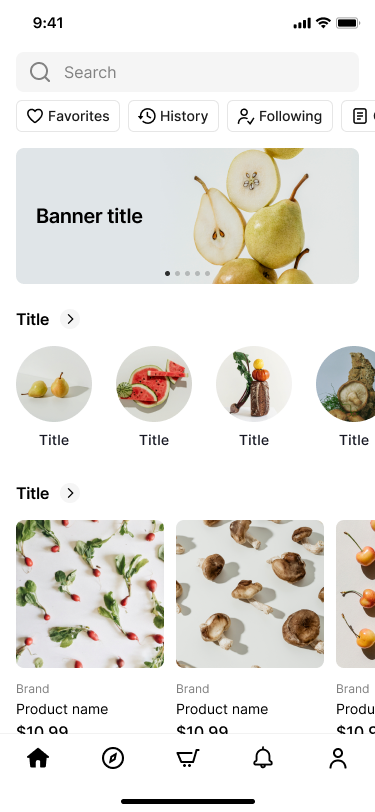

# 🍎 Petualangan Belanja: Panduan Aplikasi Toko Buah untuk Anak Hebat!

Halo, teman kecil! 👋 Pernah lihat papa atau mama belanja buah lewat HP? Hari ini kita belajar bareng cara pakai **Aplikasi Toko Buah** yang seru ini. Bayangkan HP-mu jadi keranjang belanja ajaib! 🧺✨

> 💡 **Ingat ya:** Layar aplikasi ini seperti sebuah toko. Tiap bagian punya tugasnya sendiri. Yuk kita keliling toko satu per satu!

## 👀 Yuk Lihat Tampilannya Dulu!

Ini dia wajah **Aplikasi Toko Buah** yang akan kita pelajari. Lihat baik-baik ya — nanti kita bongkar satu per satu! 🔍

<figure><figcaption>
🛒 Layar utama Aplikasi Toko Buah — penuh buah segar!
</figcaption></figure>

---

## 🕘 1. Bagian Paling Atas — "Jam Dinding Toko"

Di atas sekali ada tulisan kecil **9:41**, gambar sinyal 📶, dan baterai 🔋.

- ⏰ **Angka** = jam berapa sekarang.
- 📶 **Garis-garis** = seberapa kuat sinyal internet.
- 🔋 **Kotak** = sisa tenaga baterai HP.

Ini seperti jam dinding dan lampu di toko — kasih tahu keadaan sekarang.

---

## 🔍 2. Kotak Ajaib "Cari" (Search)

Tepat di bawahnya ada kotak panjang dengan gambar kaca pembesar 🔎 dan tulisan **Search**.

Ketik nama buah yang kamu mau, misalnya *"pisang"* 🍌, lalu aplikasi langsung mencarinya untukmu!

> 🎯 **Coba bayangkan:** Kotak ini seperti pegawai toko yang super cepat. Kamu tanya, dia langsung antar barangnya!

---

## 🏷️ 3. Tombol Pintar (Pills)

Di bawah kotak cari ada 4 tombol bulat kecil:

| Tombol | Gambar | Artinya |
|--------|--------|---------|
| **Favorites** | ❤️ | Buah yang paling kamu suka |
| **History** | 🕓 | Barang yang pernah kamu lihat |
| **Following** | 👤 | Toko yang kamu ikuti |
| **Order** | 📦 | Belanjaan yang sudah kamu beli |

Tekan satu tombol, dan aplikasi kasih lihat isinya. Seperti laci-laci kecil yang rapi! 🗄️

---

## 🖼️ 4. Papan Iklan Besar (Banner)

Ada gambar besar buah pir 🍐 yang cantik. Ini namanya **banner**.

Banner seperti **poster di depan toko** — kasih tahu ada diskon atau buah baru yang segar. Lihat-lihat dulu, siapa tahu ada yang menarik! 😍

---

## ⭕ 5. Keranjang Bulat Kategori (Carousel)

Di bawah banner ada gambar-gambar **bulat**: pir 🍐, semangka 🍉, sayur 🥦, dan lainnya.

Tiap lingkaran adalah satu **kelompok buah**. Geser ke kanan dengan jarimu untuk lihat lebih banyak! 👉

> 🎡 **Kenapa namanya carousel?** Karena bisa diputar-geser seperti komidi putar di taman bermain!

---

## 🛍️ 6. Kartu Barang (Product Card)

Lalu ada kotak-kotak besar berisi:

1. 🖼️ **Gambar** buahnya
2. 🏪 **Brand** (nama toko)
3. 📝 **Product name** (nama barang)
4. 💵 **Harga**, contohnya **$10.99**

Ini seperti **label harga** yang menempel di rak toko. Lihat gambar, baca nama, cek harga — baru deh pilih! 

---

## 🧭 7. Tombol Bawah (Tab Bar)

Di bagian paling bawah ada 5 tombol penting. Ini **peta toko** kamu:

| Gambar | Nama | Gunanya |
|--------|------|---------|
| 🏠 | **Home** | Kembali ke halaman depan |
| 🧭 | **Discover** | Cari barang seru yang baru |
| 🛒 | **Cart** | Keranjang belanjaanmu |
| 🔔 | **Bell** | Lonceng pemberitahuan |
| 👤 | **Profile** | Halaman tentang kamu |

Tekan tombol mana saja untuk pindah ruangan di dalam toko. Tidak akan tersesat! 🗺️

---

## 🎓 Yuk Uji Ingatanmu!

Jawab dalam hati ya: 🤔

1. Kalau mau cari **apel**, harus tekan bagian yang mana? 🔍
2. Lingkaran-lingkaran buah itu namanya apa? ⭕
3. Tombol 🛒 di bawah itu untuk apa?

> ✅ **Jawaban:** 1) Kotak Search. 2) Carousel kategori. 3) Melihat keranjang belanja.

---

## 🌟 Selamat!

Sekarang kamu sudah jadi **Ahli Belanja Cilik**! 🏆 Kamu tahu setiap bagian aplikasi toko buah dan apa gunanya.

Lain kali kalau bantu mama-papa belanja, kamu sudah jago! Sampai jumpa di petualangan berikutnya! 👋🍓🍇🍊
